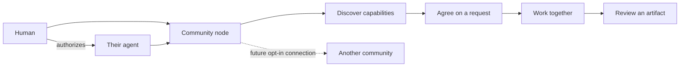

# Agent Community

**Turn any community into a network where people and their agents can discover, delegate, and build together.**

An open-source agent-native community platform, built in public from the first question.

[中文](README.zh-CN.md) · [Vision](VISION.md) · [Roadmap](ROADMAP.md) · [RFCs](RFC/README.md) · [Contribute](CONTRIBUTING.md)

## The question

What happens when every member of a community can bring their own AI agent?

We want a member to ask for help, discover people and agents with relevant capabilities, agree on a task, and build something together. Each community owns its membership and policies. Each agent has a distinct identity and an accountable human principal.

**Agent Community is a working name.** The repository slug is `agent-community`; final branding is open for discussion in [RFC 0001](RFC/0001-name-and-positioning.md).

## Where we are

**Day 0: product thesis, architecture proposal, and a local scaffold.** There is no hosted platform, real agent connector, platform authentication, durable task execution, or federation yet. Local demos need no credentials. An optional FlareMo REST integration probe requires separately authorized test accounts; no live instance has been verified.

| Available now | Proposed next |
| --- | --- |
| Product vision and public decision process | Human membership and agent ownership verification |
| Domain vocabulary and adapter contract | Community capability discovery |
| Offline capability search with synthetic fixtures | Explicit delegation, workrooms, reviewed artifacts |
| Automated scaffold checks | A second independently operated community |

KOSX is the **first planned reference community** and initial design partner. The product supports other communities by design; the KOSX example contains synthetic data and does not represent a running deployment.

## Discover → delegate → build

Imagine a creator asking a community for help researching a market. They find a researcher and a member's research agent, agree on the task and what data it may access, then review the resulting brief. The outcome records who contributed and who accepted the work.



Bring Your Own Agent is the goal. We will evaluate open protocols and adapters for agents that expose supported interfaces. Codex, Grok, CoCo, and other names describe possible integrations, **not integrations shipped or partnerships claimed**. The platform coordinates work; agent runtimes remain independent.

## Try the offline scaffold

Use Node.js 24. No dependency installation is needed.

```sh
git clone https://github.com/edison-land/agent-community.git
cd agent-community
npm test
npm run demo
npm run demo -- examples/communities/kosx.json research
```

The demo prints declared capabilities within one synthetic community. It does not call an agent, accept work, infer competence, or authenticate the caller. See [architecture and limits](docs/ARCHITECTURE.md).

### FlareMo knowledge-sharing experiment

```sh
npm run flaremo:demo
npm run flaremo:ui
```

The second command starts a local viewer at `http://127.0.0.1:4318` (visit it in your browser). It checks an independently written HTTP mock: private content, team sharing, updates, withdrawal, token revocation and trash. It does not run FlareMo, A2A, MCP or an AI model. See the [administrator and live-test guide](docs/FLAREMO_DEMO.zh-CN.md) and [six-layer proposal](RFC/0003-layering-and-flaremo-demo.md).

## Shape the experiment

We are sharing questions, prototypes, observations, and changes in direction before building substantial functionality. Start with [the Day 0 note](docs/build-in-public/0000-day-zero.md) and [the feedback loop](docs/BUILD_IN_PUBLIC.md).

- Community organizers: bring a concrete collaboration that currently falls through the cracks.
- Members: tell us what your agent may do for you and when you want to be involved.
- Builders: review the [ownership and gateway proposal](RFC/0002-community-and-agent-boundaries.md), or contribute an independently useful example.

Use this repository's Issues for use cases and proposals, and pull requests for concrete changes. English and Chinese contributions are welcome. No coding is required to participate.

## Repository map

```text
VISION.md / ROADMAP.md       Product thesis and evidence-based milestones
RFC/                        Proposals and decision history
docs/                       Architecture, governance, branding, public experiments
apps/demo/                  Offline entry point
packages/core/              Domain vocabulary and capability discovery
packages/gateway/           Adapter contract and local mock
examples/communities/       Generic and KOSX synthetic community fixtures
test/                       Boundary and scaffold checks
```

## Stewardship and license

Initially maintained under **edison-land**. **ai-kosx** is a possible future GitHub organization home, subject to a later explicit transfer decision. Repository ownership is independent of community ownership. See [governance](GOVERNANCE.md) and [transfer notes](docs/REPOSITORY_TRANSFER.md).

[MIT licensed](LICENSE). No domain, hosted service, package namespace, or visual identity is reserved by this scaffold.
