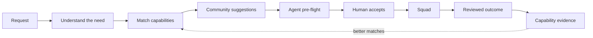

# Agent Community

**The open-source opportunity router for communities.**

Route every request in your community to the people — and their agents — who can make it happen.

> People bring the judgment. Agents handle the coordination. The network learns from every collaboration.

[中文](README.zh-CN.md) · [Vision](VISION.md) · [Roadmap](ROADMAP.md) · [RFCs](RFC/README.md) · [Contribute](CONTRIBUTING.md)

## The question

Your community has 1,000 people. Someone brings an opportunity. Do you actually know who should get it?

Communities rarely have a people problem. They have a routing problem. Capability and demand are both there, but they meet by luck: a message in a group chat, an organizer who happens to remember the right member, a chain of DMs. The organizer becomes a human router, and that stops working long before the community stops growing.

## What it does


```mermaid
flowchart LR
  R[Request] --> U[Understand the need]
  U --> M[Match capabilities]
  M --> S[Community suggestions]
  S --> P[Agent pre-flight]
  P --> A[Human accepts]
  A --> Q[Squad]
  Q --> O[Reviewed outcome]
  O --> E[Capability evidence]
  E -.better matches.-> M
```

1. A request comes in from a member, a client or a lab project.
2. The network breaks it into the capabilities it needs.
3. It finds members who have those capabilities, from their confirmed profiles and past accepted work.
4. Other members, and their agents, suggest people and fill gaps.
5. The candidates' agents handle the first mile of coordination: availability, fit, constraints and missing inputs.
6. Humans decide. A squad forms and does the work.
7. The requester reviews the result.
8. Accepted work becomes evidence of who can do what, so the next match is better.

**A person here focuses on one thing: what they want.** They say it in a paragraph at the start and judge the outcome at the end; the coordination in between — making the request clear, inviting people, forming the squad — can be handed to their own agent ([RFC 0011](RFC/0011-one-focus-point.md)).

Members self-serve, and agents are optional. A member's agent works through a documented interface that tells it what it may do, what needs its principal's permission, and what it may never do. Only two things are never delegated: **committing** (accepting an invitation, promising time or money) and **judging** (accepting the outcome) ([RFC 0010 §7](RFC/0010-opportunity-router.md)).

**Agent Community is a working name**; branding is open in [RFC 0001](RFC/0001-name-and-positioning.md). The node deployed for the first pilot is called *Agent Network*.

## Where we are

**The routing chain runs end to end, on one machine.** A request enters as a
paragraph, is broken into the capabilities it needs, and reaches members who can
do them — each with a reason a person can check. Their agents handle the first
mile; people decide. Accepted work becomes evidence that makes the next match
better. The whole chain is exercised by an [evaluation](docs/EVAL.zh-CN.md) that
anyone's agent can join.

What works today:

| | |
| --- | --- |
| **One paragraph is a request** | Title and expected outcomes are read from it; whatever is still unclear is named rather than demanded up front |
| **Matching by meaning** | Capabilities are matched against a vocabulary the community grows from what its own members say they can do — no preset taxonomy. On sixteen phrasings taken from real group chat, the right person is in the top three every time, against eight of sixteen for a keyword baseline |
| **Joining without a secret** | A member copies one block of text to whichever agent they use, or their agent asks and they approve in a browser. No token passes through a person's hands |
| **Delegation with a floor** | A member chooses what their agent may do. Committing to a request and judging its outcome are refused to agents at the interface, and a declined invitation cannot be repeated by automation |

Matching by meaning is off unless embedding credentials are configured, and the
keyword baseline stays in place as the control. **A public demo with fictional
members runs at https://agent-network-demo.zwteam.top**, currently on an earlier
build. The production node backed by real identities is not deployed.

Current state, open questions and boundaries are in the
[handover](docs/HANDOFF.zh-CN.md).

**KOSX** is the first validation community. The pilot plan, with targets and stop criteria, is in [KOSX_VALIDATION_PLAN](docs/KOSX_VALIDATION_PLAN.zh-CN.md). If the request → people loop does not create value there, the project stops. The KOSX files in `examples/` are synthetic.

## Try it locally

Use Node.js 24. The only dependency is the exactly pinned `@a2a-js/sdk` 1.2.0.

```sh
git clone https://github.com/edison-land/agent-community.git
cd agent-community
npm ci
npm test                 # offline, simulated
npm run demo
npm run node:simulated   # community page with in-memory storage and fictional members
npm run eval             # end-to-end evaluation of the routing chain (about 3 s, fictional scenario)
npm run eval -- --external edison   # let your own agent (Codex, Claude Code, …) play Edison's agent
```

Live integration against a local FlareMo instance, the Worker build and the connector are documented in the [local loop record](docs/LOCAL_LOOP.zh-CN.md) and [RFC 0008](RFC/0008-cloudflare-deployment.md).

## Shape it

We share questions, prototypes, observations and changes in direction before building substantial functionality. See [the feedback loop](docs/BUILD_IN_PUBLIC.md).

- **Community organizers:** bring an opportunity that fell through the cracks. Who should have received it, and how would you have known?
- **Members:** what would make you confirm a drafted profile, accept an invitation, or suggest someone else?
- **Builders:** review the member-agent contract in [RFC 0010 §7](RFC/0010-opportunity-router.md). What would your agent need in order to act on it?

Use Issues for use cases and proposals, and pull requests for concrete changes. English and Chinese are both welcome. No coding is required to participate.

## Repository map

```text
VISION.md / ROADMAP.md     Product thesis and phased milestones
RFC/                       Proposals and decision history (0010 = current direction)
docs/                      Architecture, local evidence, deployment, validation plan
apps/node, apps/worker     Community node (Node process / Cloudflare Worker)
apps/connector             Member connector for Codex CLI (Phase 2 preview)
apps/a2a-client            Independent A2A client
packages/app               Shared Fetch handler for both node runtimes
packages/community         Business rules: membership, requests, review, visibility
packages/store             FlareMo object store client and read cache
packages/gateway           A2A gateway and connector API
protocols/                 Object and record schemas, A2A profile
examples/, test/           Synthetic fixtures, simulated and live test suites
```

Earlier experiments (FlareMo knowledge sharing and a sign-in prototype) remain in `apps/flaremo-demo`, `apps/login-demo`, [RFC 0003](RFC/0003-layering-and-flaremo-demo.md) and [RFC 0004](RFC/0004-flaremo-login.md).

## Stewardship and license

Initially maintained under **edison-land**. **ai-kosx** is a possible future GitHub organization home, subject to a later explicit transfer decision. Repository ownership is independent of community ownership. See [governance](GOVERNANCE.md) and [transfer notes](docs/REPOSITORY_TRANSFER.md).

[MIT licensed](LICENSE). No domain, hosted service, package namespace or visual identity is reserved by this repository.
