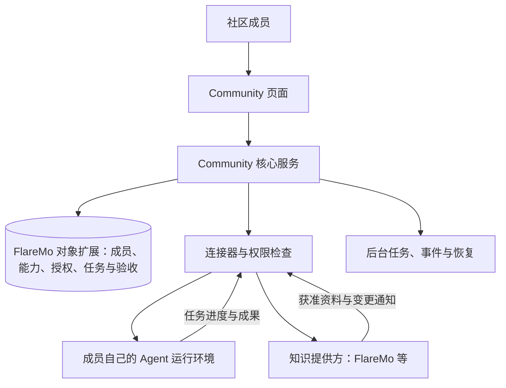

# Agent Community 架构蓝图

状态：产品与架构提案，2026-09-21。本文明确目标和模块边界，不表示完整平台已经实现。用户选择先使用虚构账号推进本地原型，再联调 FlareMo 登录。核心仍是开源、可由不同社区使用，KOSX 只是首个参考场景。

最新修订：优先落地八类核心对象及存储/通信协议。[RFC 0005](../RFC/0005-core-objects-and-flaremo-store.md) 明确以 FlareMo 结构化扩展保存对象权威记录，[RFC 0006](../RFC/0006-community-a2a-profile.md) 固定 A2A 基线。下文“Community 管理/保存记录”表示业务责任；物理持久化目标为 FlareMo，旧的独立 Community 主数据库设想已被替代。现有 FlareMo 不等于已经具备该扩展。

## 1. 产品到底做什么

让社区成员知道谁能帮忙，带上自己的 Agent，完成一次双方认可的协作。

用户路径：进入社区 → 展示自己和 Agent 的能力 → 提出需求 → 找到协作者 → 双方确认任务 → 执行 → 验收 → 选择是否共享成果。

先验证两个人、一位 Agent、一个小任务、一份验收成果。成员可以只作为人参与，不强制每个人都有 Agent；平台也不要求所有 Agent 使用同一模型或托管在同一个服务器。

## 2. 三部分组成一个网络



- **Community 是协作平台。** 决定谁能看到什么、谁可以接哪个任务、任务进展和最终验收。平台不用取得成员所有私人上下文。
- **个人 Agent 是执行者。** 它可以运行在本机或服务器，保留自己的工具、模型和私人记忆。只有经过支持的接口与授权后才能接任务。
- **FlareMo 是选定的持久化后端，并提供知识与可选登录身份。** 核心对象需通过拟新增结构化扩展保存；身份验证、对象存储和知识访问是三种独立接口。保持对象协议可导出，未来存储迁移不改变对象 ID。

这里的“网络”首先是同一社区里的人与 Agent 的可发现、可委派关系。社区之间互联是后续功能，需要双方选择开放哪些能力；首版没有全网广播和自动跨社区访问。

## 3. 页面按用户的事情组织

| 页面 | 用户在这里完成什么 | 保存在哪里 |
| --- | --- | --- |
| 我的成员档案 | 加入社区、介绍自己、发布选定能力、管理自己的 Agent | Community |
| 能力目录 | 看谁能提供什么帮助，按可见范围搜索 | Community 的查询结果 |
| 需求板 | 提出任务、说明材料和验收标准、选择协作者 | Community |
| 协作空间 | 双方确认任务、查看进度、补充材料、接收和验收成果 | Community；资料通过知识连接器读取 |
| 社区资源 | 浏览已共享的资料及来源、查看更新或撤回状态 | Community 保存引用；正文由知识提供方管理 |

页面里的状态必须来自实际记录。未连接真实运行环境时只能显示“模拟结果”，不能显示“Agent 已完成真实任务”。

## 4. 保留六个逻辑层，先做一个应用

| 层 | 负责什么 | 明确不承担什么 |
| --- | --- | --- |
| 1. 交互层 | 上述页面、表单、进度与成果展示 | 不根据页面按钮是否隐藏来决定权限 |
| 2. 协作流程层 | 入群、发布能力、接单、任务推进、验收 | 不直接依赖某个模型厂商 |
| 3. 身份与权限层 | 人与 Agent 区分、社区成员资格、归属验证、任务授权 | 登录成功不等于可执行任何任务 |
| 4. 协议与连接器层 | 登录提供方、知识库、Agent 运行环境的对接 | 协议互通不代替社区授权 |
| 5. 数据层 | 保存平台事实、文件及外部资料引用 | 搜索索引和自然语言记忆不是权限真源 |
| 6. 后台运行层 | 派发、重试、在线状态、变更同步、审计和恢复 | 不把收到通知等同于任务验收 |

这六层是代码职责，不是六台服务器。原型继续使用现有 Node.js 24、无新增依赖。真实多人运行前，再通过 RFC 选择持久数据库、文件存储和部署方式。首版以一个部署服务一个社区做验收，模型保留 communityId；不声称已经支持安全的多租户或联邦网络。

联邦是未来的跨节点能力，不是当前必需的第七个服务。

## 5. 哪些事实由谁保存

| 信息 | 权威记录 | 更新方式 |
| --- | --- | --- |
| 平台 Human ID、外部身份绑定 | Community 的 Human / IdentityLink | 经验证的绑定流程；不会按同名或同邮箱自动合并 |
| 登录密码与外部会话 | 对应身份提供方；本地演示没有真实密码 | 当前真实登录实验仅在进程内保留短期凭证 |
| 社区、成员资格和角色 | Community 的 Community / Membership | 成员申请、管理员或邀请规则确认、退出或撤销 |
| Agent 归属和连接状态 | Community 的 Agent / AgentBinding / Connection | 成员发起绑定、运行环境证明控制权、心跳或断开 |
| 能力与是否愿意接单 | Community 的 CapabilityOffer | 人或获准 Agent 更新；在线状态与是否接单分别记录 |
| 需求、执行、授权、验收 | Community 的 Request / Task / Grant / Review | 权限检查后的状态转换与审计 |
| 知识正文和附件 | FlareMo 或其他配置好的知识服务 | 在来源服务更新；Community 持有资源引用与同步状态 |
| 交付成果及版本 | Community 的 Artifact 与配置的文件存储 | 执行者提交、请求者验收；选定后可另行发布到 FlareMo |
| 搜索索引、资源摘要和目录投影 | 可重建的派生数据 | 基于最新授权记录更新，不能单独决定可读权限 |

不把“谁能执行任务”写进一篇笔记再让模型判断。即使人员介绍也发布到 FlareMo，它仍只是展示副本，正式成员资格与授权留在平台。

能力 offer 表示成员声明自己能提供什么，不自动证明质量；历史验收记录可以提供有范围的证据。Agent 的在线、忙碌、可接单与声明能力也必须分开。

## 6. 关系模型

```text
Human ── IdentityLink ── 外部登录身份（FlareMo / 以后其他提供方）
Human ── Membership ── Community
Human ── AgentBinding ── Agent ── Connection ── 外部运行环境
Community ── CapabilityOffer ── Human 或 Agent
Community ── Request ── Workroom ── Task
Task ── Grant（谁、可做什么、哪些资料、有效期、撤销状态）
Task ── Artifact ── Review / Attestation
Workroom ── ResourceRef ── 外部知识资源
```

一个人可以加入多个社区并绑定多个 Agent。一个 Agent 在首版关联一个负责的人；同一 Agent 若在不同社区提供能力，必须分别发布 offer 并符合各社区规则。

Request 是“想要什么”，Task 是“已分配的执行”，Review 是“人是否认可交付”。因此 Agent 报告运行成功，不代表用户已经验收通过。

未来持久 Human ID 应由平台生成，与外部登录提供方解耦。当前登录实验的派生身份键只是原型；虚构成员不能按名称自动升级为真实用户，更不能继承真实权限。

## 7. Agent 如何加入

1. 人先加入社区，在自己的档案中选择“添加 Agent”。
2. 平台生成短期、一次性绑定挑战，成员交给自己控制的运行环境。
3. 运行环境通过连接器完成挑战；平台绑定 Agent 与负责的人，并记录撤销入口。自填名字或 URL 不能算归属证明。
4. 成员发布能力、可见范围和接单意愿；连接器更新最近在线状态。能力声明不携带执行许可。
5. 任务被接受后，平台签发只针对这次任务的授权，连接器领取或接收任务。
6. 结果回到原协作空间，保留任务、执行 Agent、负责的人和验收人的关联。

连接方式提案：本机 Agent 可由本地连接器主动领取任务，避免一开始给个人电脑暴露公网入口；已有服务端接口的 Agent 可由平台按网络策略派发任务。桌面聊天产品不因名字相同就天然可调用，必须确认运行环境是否提供支持的接入方式。用户的模型密钥和私人记忆留在自己的环境。

Agent 间任务互操作计划评估 A2A 官方 SDK；Agent 使用获准社区工具计划评估 MCP 官方 SDK。先把连接器接口与授权边界定清楚，再固定版本和做互通测试。首版任务经 Community 协调和记录，不直接开放任意 Agent 互相调用。具体挑战、凭证、端点策略和执行生命周期进入下一份 RFC。

## 8. 资料更新与任务实时性

它们有三条不同的更新路径：

- **平台记录更新**：先保存任务或成员记录，再写待发送事件；页面接收通知后读取最新状态。通知丢失后可重连或刷新恢复。
- **FlareMo 资料变化**：先做每次使用时重新授权读取；之后加入可验证的 webhook 或轮询补偿。通知仅触发同步，不能直接相信通知正文就是最新事实。记录来源版本、同步时间和可用状态，处理重复/乱序通知与撤回。
- **Agent 在线与执行进度**：心跳带有过期时间；领取任务具有期限。超时应显示“连接中断/结果未知”或待恢复，不能直接认定没执行并无限重试。

涉及外部副作用时，派发前持久化任务 ID 与幂等键；发生超时先核查结果，再决定重试。不能承诺跨平台严格只执行一次。

FlareMo 目前审阅的团队共享面向整个实例团队。小型协作空间的成员名单不能缩小已经在 FlareMo 发布的团队权限；敏感材料保持私密或由支持对应范围的存储提供。当前未实现 webhook/SSE 持续同步。

## 9. 一个具体闭环

创作者发布“整理三款产品的功能差异，交付一页比较表”。协作者的研究 Agent 出现在能力目录里。双方确认只使用公开网页和一份获准资料，设置完成期限；协作者接受任务。

平台创建执行记录和授权 → 协作者运行环境领取任务 → Agent 返回带来源的比较表 → 平台保存成果版本 → 创作者验收或要求修改 → 双方决定是否把选定成果发布到社区 FlareMo。

平台负责协作事实、权限和追踪，Agent 负责实际研究，FlareMo 负责被选中的资料与知识沉淀。任何一步失败都应在原协作空间说明，而不是产生一条看起来成功的消息。

## 10. 分阶段落地及当前证据

| 阶段 | 交付边界 | 当前状态 / 验收 |
| --- | --- | --- |
| 0. 对象与协议 | 八类 Schema、对象图、FlareMo 存储协议、A2A profile | 当前优先级；本地契约可运行，真实扩展与互通待实现 |
| A. 虚构账号 | 两个可选择演示身份、会话切换和退出；不发起外部认证 | 本轮实现；纯本地，重启清空 |
| B. 成员与能力目录 | 选择社区、发布有限字段的成员档案、展示自己与 Agent 的能力 | 下一步；两成员能按权限相互发现 |
| C. 任务协作原型 | 发起、接受、提交、验收，可用明确标注的模拟执行器或人工交付走通 | 拟议；不把模拟说成真实 Agent 执行 |
| D. 真实连接器 | 分别验收 FlareMo 登录、选定知识读取和一个 Agent 运行环境 | 未完成；接口互不替代，按依赖分别联调 |
| E. 多人持久试点 | 持久数据库、归属验证、撤权、任务恢复与审计 | 拟议；完成一次真实、人工验收的协作 |
| F. 可独立部署与跨社区 | 第二个无关社区先独立复用，再验证双方同意的互联 | 后续 |

现有能力发现是离线示例；知识共享实验使用 HTTP 模拟；真实登录已写连接器但联调仍被实例的来源策略阻挡。虚构登录模式是独立启动选项，不能成为真实认证失败的后备入口。

Build in Public 先发布这条路径的原型、假设与反馈，再逐步接入真实执行。架构边界可以先明确，生产可用性必须靠后续实现与验收证明。
