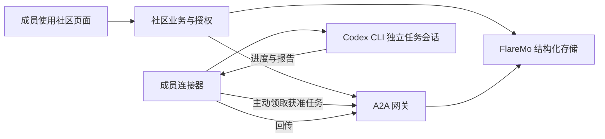

# Agent Community：从本机闭环到外部 Agent 接入

> **已完成并被取代。** 这份计划在 2026-09-21 提出、已经执行完毕，保留是因为 RFC 0007 与本机闭环记录引用它。当前状态见 [交接说明](../HANDOFF.zh-CN.md)。

日期：2026-09-21

状态：实施计划，尚未执行。用户已选择本机独立 FlareMo、Codex CLI、逐单确认、调研报告场景；本文不代表相关能力已经实现或验收。

## 给 Claude Code 的执行入口

在当前仓库执行本计划。先读根目录 [AGENTS.md](../../AGENTS.md)、[README.md](../../README.md)、[VISION.md](../../VISION.md)、[ROADMAP.md](../../ROADMAP.md)、[CONTEXT.md](../../CONTEXT.md)，再读相关协议：

- [RFC 0004：FlareMo 登录](../../RFC/0004-flaremo-login.md)
- [RFC 0005：八对象与 FlareMo 存储](../../RFC/0005-core-objects-and-flaremo-store.md)
- [RFC 0006：Community A2A Profile](../../RFC/0006-community-a2a-profile.md)
- [对象 Schema](../../protocols/community/v0.1/object.schema.json) 与 [A2A 配置](../../protocols/a2a/v0.1/profile.json)

先核对实际代码与 Git 状态，保护已有改动。按本文阶段推进，在 RFC 中记录新增边界和实现选择，特别是 Agent 归属证明、连接器协议和执行授权；发现现有草案冲突时明确记录，不静默改变用户已选方向。完成各阶段后记录真实命令、结果及未通过项，不以模拟测试代替真实接入。

代码变更执行仓库要求的 `npm test`、`npm run demo`；对象变更同时运行 `npm run objects:demo`，发现逻辑变更覆盖两份社区 fixtures。新增真实存储与连接器测试按下文验收要求执行。不要把修改后的功能状态写成已经通过尚未运行的测试。

本计划不包含公网部署、购买服务、发布软件包、修改线上 FlareMo、转移仓库或向他人发送消息。需要登录时由用户在本机完成，不索取或记录密码、令牌及模型凭证。

## 1. 目标与范围

第一版完成：**成员 A 发布调研需求，成员 B 确认后，由自己的 Codex CLI 执行，成果存入 FlareMo，再由 A 验收。**

用户已确定：

- 使用独立的 FlareMo 测试实例，先在本机运行。
- 首个适配器支持 Codex CLI，之后再接 Claude Code CLI。
- Agent 主人逐单确认，每个任务使用独立会话。
- 首个场景交付调研报告。
- 本轮不开放公网；“外部成员成功接入”作为下一阶段独立验收。

目前已有对象协议、A2A 草案和内存演示；真实持久化、连接器和执行流程需要补齐。现有内存对象 harness 不是生产存储或权限系统。线上 `flaremo.kosx.ai` 的登录联调尚未通过，不是本轮测试实例。

## 2. 架构：六层职责，先用少量进程实现

| 层 | 负责什么 |
|---|---|
| 社区界面 | 成员档案、Agent 接入、能力目录、需求与成果验收 |
| 协作业务 | 八个对象的关系、状态变化、任务分配与验收规则 |
| 身份与授权 | 真人身份、社区成员资格、Agent 归属、逐单授权与撤销 |
| 通信网关 | A2A 接口、任务路由、状态查询与取消 |
| 成员连接器 | 主动领取任务，调用本机 Codex CLI，回传进度与成果 |
| FlareMo 存储 | 对象、授权、执行记录、事件和成果文件的持久保存 |

**成员的电脑和服务器使用同一个连接器。** 区别主要是在线时间：电脑休眠后暂停接单，服务器可以持续运行。后续开放外部接入时，连接器仍主动连接社区，无需给成员电脑开放入站端口。

## 3. 核心实现

### FlareMo：八个对象的权威存储

基于独立 FlareMo 源码副本实现结构化扩展，保留上游许可证；社区仓库通过接口访问，不混入上游代码。

八个对象贯穿完整流程：

**Community → Human → Agent → Capability → Request → Workroom → Artifact → Attestation**

同时保存成员关系、身份映射、Agent 绑定、授权和执行记录。这些是支撑记录，不增加产品核心对象数量。

落实现有存储草案的接口（这些是拟新增接口，不是上游现有能力）：

- `/api/community/v1/transactions`：原子写入、版本检查、重复命令去重。
- `/objects`：按权限读取、查询对象及历史版本。
- `/events`：按游标获取变化，支持重启后补同步。
- `/blobs`：保存成果文件，并关联内容哈希与对象版本。

后三项均位于 `/api/community/v1` 前缀下，具体契约以 RFC 0005 为准。

结构化记录进入 FlareMo 的 D1，文件进入 R2；本机阶段使用其本地运行环境。普通笔记可以展示对象摘要，但授权和任务状态必须读取结构化记录。不得静默增加另一套独立可写的权威社区数据库。

### 身份与 Agent 绑定

本机真实联调使用独立 FlareMo 测试账号；现有虚构登录模式继续明确标注，不自动转成真实身份。

连接器在成员机器上登记，得到一次性认领链接；成员登录后打开链接、核对连接器信息并输入终端上指纹的最后 4 位，建立 **Human—Agent—连接器** 绑定。（2026-09-21 修订：参考 EvoMap 的认领方式，替换原先的“页面生成配对挑战”，旧方式已删除，见 RFC 0007。）

绑定只证明该成员控制连接器。发布能力、允许接单、批准某次执行分别处理。模型登录凭证保留在成员机器上。

### Codex 连接器

新增独立 Node.js 连接器，提供登记、启动、查看状态、换密钥、停止和解绑功能。

连接器主动长轮询领取任务，调用 Codex CLI 的非交互模式，解析结构化事件。任务输入通过标准输入传递，不拼接成可执行的 shell 命令。

首版使用独立工作目录和会话，调研任务基于明确选定的公开资料包。只上传报告、来源和必要执行状态，不默认上传私人记忆、完整会话或本地文件。

每单确认展示：任务内容、共享资料、所用模型、执行时限以及由成员自己的模型账号承担用量。遇到额外权限需求暂停处理，不自行扩大权限。

### A2A 与执行可靠性

采用已有草案固定的 **A2A 1.0、JSON-RPC、SSE 和官方 JS SDK 1.2.0**，实现发送、查询、订阅和取消任务。[规范](https://a2a-protocol.org/latest/specification/) · [SDK 基线](https://github.com/a2aproject/a2a-js/releases/tag/v1.2.0)

网关为已绑定的 Agent 提供 A2A 接口；连接器领取任务属于内部机制。Codex CLI 本身不被宣称为原生 A2A 服务。

- 派发前持久保存授权、Execution 和待发送事件。
- 同一执行重复领取时不重复启动 CLI；连接器保存本地执行回执供恢复核对。
- 断线后先查询状态；无法确认是否执行过时显示“状态待确认”，不盲目重跑。
- 撤权立即阻止后续平台访问，并请求停止 CLI；未收到停止确认时如实显示。
- Agent 完成只进入“待验收”；需求方确认特定成果版本后，才生成 Attestation。

## 4. 实施顺序与验收

| 阶段 | 交付与通过标准 |
|---|---|
| ① 存储 | 八类对象写入真实本地 FlareMo，重启后仍存在；版本冲突、原子回滚、重复写入和跨社区隔离通过测试 |
| ② 身份与授权 | 两个测试账号加入社区；连接器登记与认领、认领链接过期与重复使用、防钓鱼、换密钥、解绑及撤权通过测试 |
| ③ A2A 互通 | 独立客户端与网关进程完成发送、查询、流式更新和取消；伪造身份、错误授权被拒绝 |
| ④ Codex 执行 | 真实 CLI 完成资料调研，生成报告；失败、超时、断线及连接器重启均有可解释状态 |
| ⑤ 产品闭环 | 页面完成发布需求、发现能力、成员确认、观察进度、查看成果、验收；八类对象均可追溯 |

每阶段分别记录模拟测试与真实联调证据。最后提供一套可重复启动的本机演示和重启恢复测试，不把页面成功提示当作持久化或互通证据。

完成交付时说明：哪些阶段通过、启动方式、测试结果、尚存限制。Build in Public 记录只使用合成或脱敏材料，不能包含真实凭证和参与者私有资料。

## 5. 后续外部接入的门槛

本机闭环通过后，再增加公网 HTTPS 入口、邀请制成员注册和外部机器联调。连接器与对象协议保持不变。

开放前必须额外验证：运行环境隔离、连接凭证轮换、离线撤权、访问范围、备份恢复，以及第二台独立机器的真实执行。独立目录和 CLI 权限参数不等于完整的机器隔离。

暂缓联邦网络、支付、自动接单和共享私人记忆。KOSX 通过社区配置加入；GitHub 所有者及未来组织迁移不影响对象身份与通信协议。
